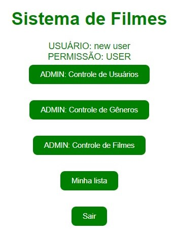

# 🎞 Front-end para o [Sistema de Filmes](https://github.com/EnzoHonorato/api-filmsystem) 

Se trata de um front-end básico que utiliza HTML, CSS e JavaScript para consumir a API do [sistema de filmes](https://github.com/EnzoHonorato/api-filmsystem) 

A API é consumida utilizando Fetch API e, enquanto o usuário está logado, o seu token JWT fica salvo no Local storage do navegador.

## Imagem de exemplo do front

